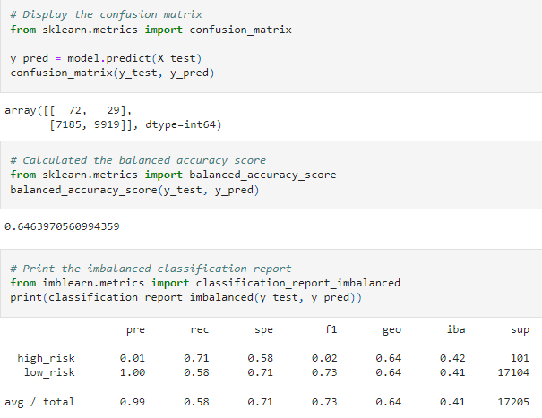
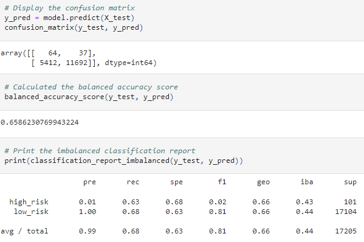
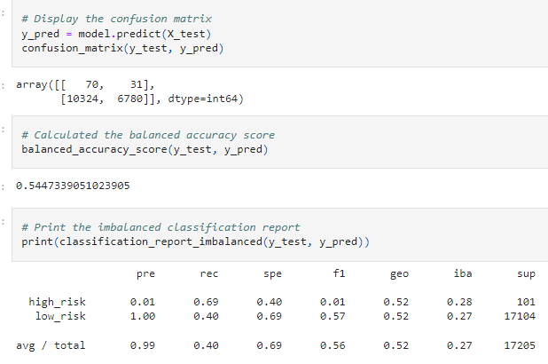
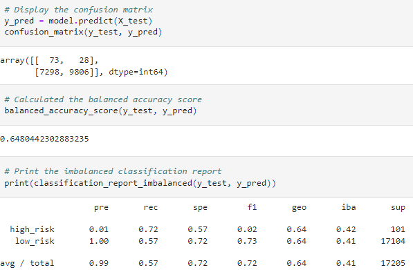
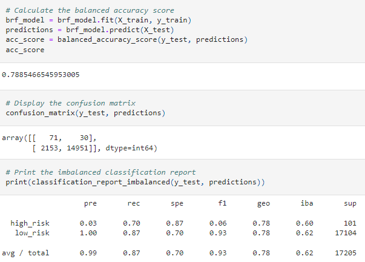
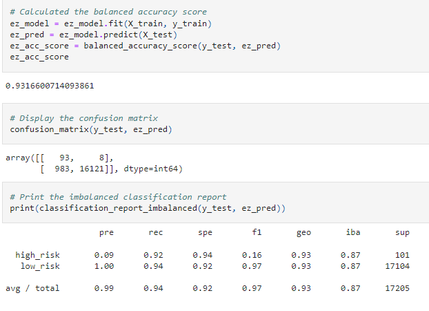

# Credit_Risk_Analysis
Module 17: Supervised Machine Learning
## Overview
The goal of this project is to use skills in data preparation, statistical reasoning, and machine learning to solve a real-world challenge of credit card risk. Different techniques will be employed to train and evaluate models with unbalanced classes, such as: resampling and the imbalanced-learn/scikit-learn libraries.

A credit card dataset will be sourced from the LendingClub and oversampled using RandomOverSampler and SMOTE algorithms. Then, the dataset will be undersampled using the ClusterCentroids algorithm. After which, a combinatorial approach of over- and undersampling using the SMOTEENN algorithm will be utilized. Finally, two new machine learning models that reduce bias will be compared, BalancedRandomForestClassifier and EasyEnsembleClassifier, to predict credit risk.

## Results
#### Balanced accuracy, precision and recall scores of all six machine learning models

### Naive Random Oversampling

  * Balanced Accuracy Score: 0.64

  * Precision: 72/(72 + 7185) = 0.01

  * Recall: 72/(72 + 29) = 0.71

### SMOTE Oversampling

  * Balanced Accuracy Score: 0.66

  * Precision: 64/(64 + 5412) = 0.01

  * Recall: 64/(64 + 37) = 0.63
  
### Undersampling

  * Balanced Accuracy Score: 0.54

  * Precision: 70/(70 + 10324) = 0.01

  * Recall: 70/(70 + 31) = 0.69
  
### SMOTEENN

  * Balanced Accuracy Score: 0.65

  * Precision: 73/(73 + 7298) = 0.01

  * Recall: 73/(73 + 28) = 0.72
  
### Balanced Random Forest Classifier

  * Balanced Accuracy Score: 0.79

  * Precision: 71/(71 + 2153) = 0.03

  * Recall: 71/(71 + 30) = 0.70
  
### Easy Ensemble AdaBoost Classifier

  * Balanced Accuracy Score: 0.93

  * Precision: 93/(93 + 983) = 0.09

  * Recall: 93/(93 + 8) = 0.92

## Summary
Easy Ensemble AdaBoost Classifier had the highest balanced accuracy score of 0.93 and the largest recall of 0.92.
Thus, my recommendation would be to use the Easy Ensemble AdaBoost Classifier to predict credit risk.

## Resources
Data [LoanStats_2019Q1.csv](LoanStats_2019Q1.csv)

Software: Python, Jupyter Notebook

Libraries: warnings, numpy, pandas, pathlib, collections, sklearn.metrics, imblearn.metrics, imblearn.ensemble, sklearn.preprocessing
